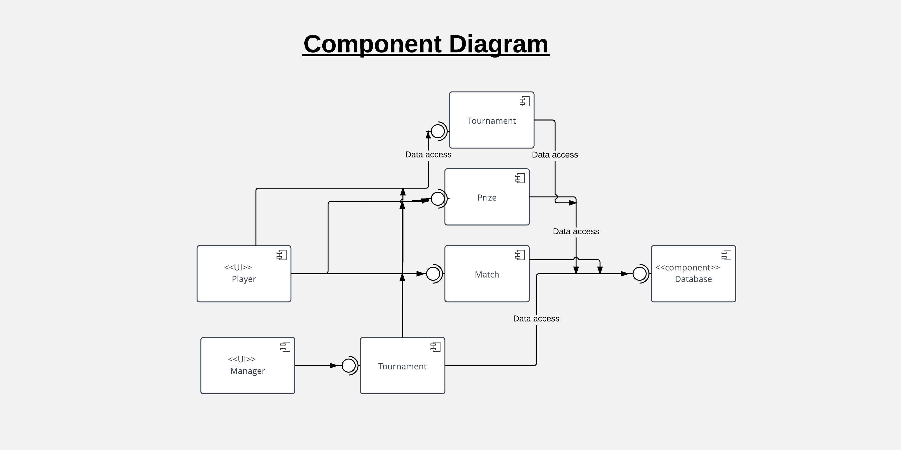
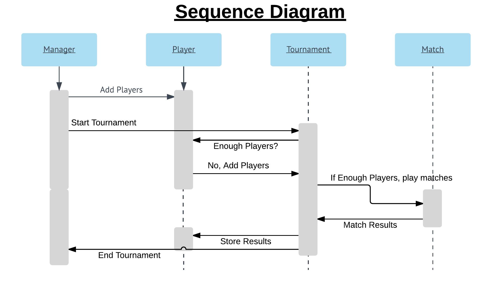
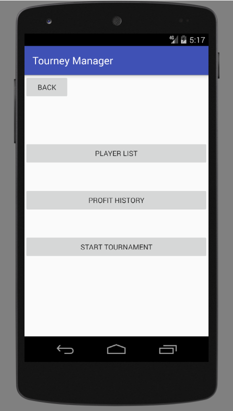
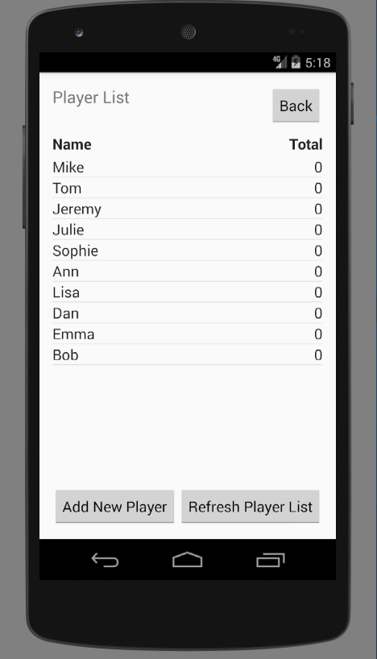
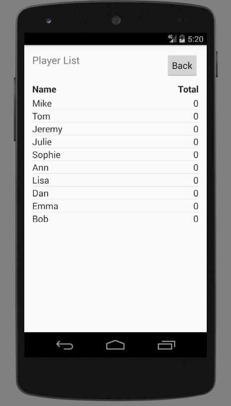

# Design Document

**Author**: Team 50

## 1 Design Considerations

### 1.1 Assumptions

  -  Database is local and ready to use/integerate with the app.
  -  No authorization is needed to switch between Player & Manager. User of the apps can easily switch between the two without any security implementation

### 1.2 Constraints

  - Database integration could have a significant impact on the design of the system
  - No other constraints are present which may have a significant impact on the design of the system

### 1.3 System Environment

  - It is an android based app which means the user must have an android based device in order to use the Tourney Manager app

## 2 Architectural Design

### 2.1 Component Diagram

### 2.2 Deployment Diagram

  - This diagram is unncessary for the purpose of this project because of the simplicity of the system. There is only one Node in play here which is the application node.

## 3 Low-Level Design

### 3.1 Class Diagram

### 3.2 Other Diagrams

## 4 User Interface Design

